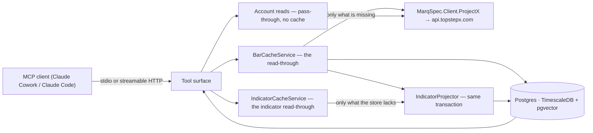

# Architecture

**Companion to:** [`prd.md`](prd.md) (*what* must be true) and [`mcp-tool-catalog.md`](mcp-tool-catalog.md)
(the surface). **Status:** Living · **Date:** 2026-08-21

The runtime view: the pieces, and what happens on a tool call.

## Shape

Three assemblies, layered so the pure part stays pure:

| Project | Depends on | Holds |
|---|---|---|
| `…​.Domain` | **nothing** | `Bar`, `InstrumentId`, `InstrumentSpec`, `IIndicator` and `ILevelMethod` + implementations, `BarSessionCalendar`, `BarGapDetector`, `KeyLevels`, `SessionLevels`, `PivotLevels`, `VolumeLevels`, `TradeDirection`, `FootprintAggregator`, `VolumeProfileAggregator`, `TapeVolumeFront` |
| `…​.Data` | Domain | Entities, `DbContext`, migrations |
| `MarqSpec.Mcp.TopstepX` | Domain, Data, the venue client | Tools, transports, cache-aside services, the ProjectX adapter, composition root |

`Domain`'s emptiness is load-bearing. An indicator is a pure function of the bars handed in, and that is what
makes "rebuild = replay" true — a dependency on a clock or a store there would make a recomputation depend on
*when* it ran, and no test would notice. The footprint aggregation is the same shape: a pure function of the
prints handed in, which is why `TradeDirection` lives here rather than on the store entity (gh#220).
The volume profile is the next projection over those cells: a pure function of the cells and the
listening ranges handed in — point of control, 70% value area, and a window confined to one
contract (`R-9`, gh#221). It is not a stored table. Volume-front is a third pure read over the
prints themselves: per session, per contract, highest `Size` wins, including an `Unknown`
direction (gh#219). It is not a stored table either, and it is not the profile's `contracts`
block.

**A session boundary is the one thing bars cannot supply, and it arrives by construction rather than by
widening a signature.** `vwap`, `session` and all five `pivot-*` need to know where a session begins; neither
`IIndicator.Compute` nor `ILevelMethod.Detect` carries a calendar, and neither gained one — the pivot family
was the third method family to want one and the second to be built on the answer (gh#258). `IndicatorCatalog`
and `LevelMethodCatalog` each take the single `BarSessionCalendar` the composition root parses once from
`MarketData__SessionCloseCentral` and `MarketData__Holidays`, and hand it to the one member that needs it.
That is a **value**, not a source — deterministic in its configuration, fixed for the process — so a method
holding one is still a pure function of what it was built and handed, and every other method keeps a
signature free of a parameter it would never read (gh#257).

**A request-scoped tape is the other thing `Detect` cannot see, and it does not take that constructor
path.** Cells and the profile they roll up to belong to this request's window. Widening `Detect`, putting
the tape on `KeyLevelOptions`, deriving a POC from bar volume, or hanging request-scoped cells on
`LevelMethodCatalog`'s constructor were all refused (gh#319). The fourth path is a `VolumeProfileScope`
bound around the call: the four `volume-*` methods are constructed without a profile so they stay in
`LevelMethodCatalog.All`, `Detect` reads the bind after the roll and ordering guards, and a call with
nothing bound refuses rather than spreading OHLCV.

**The catalogue also carries correlation, because the scorer must not.** Every `ILevelMethod` declares the
family it belongs to; the five `pivot-*` names share one, the four `volume-*` names share one, `swing` and
`session` are families of one. A
confluence score groups by that rather than by a list of names it holds itself, so the next pivot variant
joins the discounted budget by being written rather than by somebody remembering to add it (`R-3.11`).

## The cache-aside read — the only genuinely interesting path

**`resolution` is chosen by the caller, not by configuration.** There is no supported-resolution list: every
whole number of minutes from **1 to 10,080** is servable (`R-1.9`), each becomes an independent cached series,
and a timeframe is fetched from the venue rather than derived from a finer one —
[ADR-0010](adr/0010-per-call-resolutions-fetched-not-derived.md).
Zero and negative are refused at the tool boundary by `ToolGuards.ValidateResolution` and never reach this
path (gh#69).

`BarCacheService.GetBarsAsync(instrument, resolution, window)`:

1. **Read** the stored bucket starts for the window, split by whether the row records the contract that
   produced it. A bucket carrying no `ContractId` is *not* counted as held: the venue is re-asked and the
   upsert heals it ([ADR-0011](adr/0011-contract-roll-boundary.md), gh#402).
2. **Ask the calendar** which buckets the venue was expected to publish — `BarGapDetector.ExpectedBuckets`
   over `BarSessionCalendar` — **plus** the unattributed buckets from step 1, which are enumerated even when
   the calendar does not expect them. Off the grid they would otherwise never be asked for, and the window
   would report its contract span as `Unknown` for good (gh#412).
3. **Diff.** Nothing missing ⇒ return. **Zero vendor calls** (R-1.3).
4. **Consult the coverage ledger.** A range the vendor previously answered empty is treated as covered, so a
   genuine hole is not re-requested forever.
5. **Fetch** each remaining range, paged at `1000 × barSize` — the gateway caps a history call at 1000 bars and
   silently truncates past it. The pages are **paced** to the vendor's 50-per-30-seconds allowance on the
   history endpoint, shared process-wide, because a cold year of five-minute bars is 106 requests back to back
   (`R-1.10`, [wiki — rate limits](wiki/pages/projectx-gateway-api.md#rate-limits)). Every bar is **stamped
   with the contract it was fetched from**, here and nowhere else: one layer up, the series is keyed by the
   symbol alone and the fact is gone ([ADR-0011](adr/0011-contract-roll-boundary.md)).
6. **Drop still-forming bars** (`OpenTime + barSize <= now`) even though the request already sends
   `includePartialBar: false`. This does not depend on a venue behaving.
7. **Upsert** on `(Venue, Instrument, ResolutionMinutes, BucketStart)` — one `ON CONFLICT … DO UPDATE`, so the
   insert-versus-update decision is made against the row the store has **committed** rather than against this
   transaction's snapshot of it (gh#103). The composite key *is* the idempotence guard, and this is how the
   write reaches it. A read of the overlap still runs first, but only to drop the buckets that have not moved
   before they are sent; the rule that an unchanged bar is not rewritten is restated in the statement's own
   `WHERE`, where both sides carry the column's `numeric(18,8)`. **The write bypasses the change tracker, so
   every read of `Bars` is `AsNoTracking`** — a tracked row is a copy the identity map would hand back to the
   next call in the same scope in preference to the row it just read, and both the context and the cache
   service are scoped (gh#103).
8. **Project indicators** for the affected buckets, in the same unit of work, so an indicator exists the moment
   its bar does. The values are written with one `ON CONFLICT … DO UPDATE` on
   `(Venue, Instrument, ResolutionMinutes, Indicator, Period, BucketStart)`, for the same reason step 7 is
   (gh#133) — a pass recomputes the whole series *its own snapshot* can see, so two fills of ranges sharing no
   bucket still both produce the history in front of both. There is **no skip-unchanged `WHERE` here**, unlike
   step 7: the rule is stated once, in C#, because the value is rounded to the column's own scale before it is
   compared and the stored side came out of that column, so both sides already carry `numeric(18,8)` (gh#37).
   The removals still go through the change tracker, so this step needs a **transaction** around it rather than
   merely one snapshot, and refuses without one.
9. **Record coverage** for ranges that came back empty — one `ON CONFLICT … DO UPDATE` on
   `(Venue, Instrument, ResolutionMinutes, RangeStart, RangeEnd)`, for the same reason step 7 is (gh#122).
   There is **no pre-read here at all**: the ledger holds the latest answer for a range rather than a history
   of asking, so `RecordedAt` moves on every ask and there is no unchanged write to save. `ExpiresAt` is
   assigned unconditionally, `null` included — `null` means *never*, not *not recorded*, so preserving a
   stored expiry would leave a permanent claim wearing the TTL it was given while the range was still recent.

**Step 5 sits outside the transaction; steps 7–9 sit inside one, at `RepeatableRead`.** The projection reads
the bars and then the values standing over them; under `READ COMMITTED` those are two snapshots, so a
concurrent fill of the same series can commit between them and the pass then deletes values it never saw the
bars for (gh#73). Not `SERIALIZABLE`: SSI would take predicate locks over a whole-series scan, escalate them
from page to relation on `Bars`, and start aborting fills of unrelated instruments — for an anomaly that is
read skew between two statements, which `RepeatableRead` already forbids.

**The fetch is deliberately outside.** The pacer sits inside the gateway's page loop, so a cold year of
five-minute bars is 106 pages at 50-per-30-seconds — about a minute of sleeping. Holding a snapshot across that
would pin the transaction's `xmin`, and vacuum's horizon with it, for the whole minute, and would widen every
serialization window on this path from milliseconds to a minute. The whole venue answer is held in memory and
written afterwards.

**One retry, and the conflict it survives is ordinary.** Snapshot isolation turns a silent last-writer-wins
into a `40001`, and that is reachable from the tool surface: the reconcile is unscoped by bucket range, so a
whole-series sweep is a whole-series *write set* — two fills whose fetched ranges share no bucket still delete
the same unjustified rows — and the coverage ledger reaches it with no bars at all, because two callers asking
for one empty range both *write* one row, whether that row already existed or not (gh#122). The retry is not a
gamble: in every shape of this conflict the
transaction that won committed exactly the work the loser was missing, so the second attempt runs over a
better-informed store, and because the fetch already happened it costs no vendor requests. A second collision
is sustained contention rather than a race, so it becomes a `StoreContentionException`, which the **store-fault
boundary** below turns into an `McpException` naming the condition rather than a nested Postgres stack.

**Every store fault stops at one boundary, not at a call site.** A `StoreFaultGuard` call-tool filter is
registered on the MCP server itself, so *every* `tools/call` passes through it — a tool added tomorrow is
covered by having been registered rather than by its author remembering a `try`. It translates a
`StoreContentionException`, a `DbUpdateException` and a bare `NpgsqlException` into an `McpException` stating
the condition and its SqlState; it catches nothing else, so an `InvalidOperationException` — the projector's
whole-series guard among them — still propagates as the defect it is. Before it, `BarTools.ReadAsync`
was the only translation on the surface, and the thirteen tools that never call it had none: a `23505` from
two overlapping fills reached a caller of `get_bars` as a raw `DbUpdateException` (gh#89).

**The boundary says only what a filter can know, which is less than any one call site knows.** It sees an
exception type and a SqlState — not which unit of work was open, not what shared it, and not whether a write
reached disk. Three consequences, and they are the contract the tool surface offers:

- **An unknown outcome is reported as unknown.** Postgres can commit and then lose the connection before the
  acknowledgement arrives. Npgsql raises a bare `NpgsqlException` with *no* SqlState, EF wraps it, and the
  rows may well be on disk — so that branch claims no outcome at all. It says the call did not complete, that
  the fate of its write is unknown, and that reading back is how to establish what landed. Reporting a
  completed operation as not having happened is the failure this repository reviews for first.
- **A rollback is claimed only where the server established one.** A `PostgresException` means the server was
  alive and answered, and in Postgres an error response and an aborted transaction are the same event. No
  SqlState means no such evidence.
- **Transient and permanent are told apart by SqlState class, not by CLR type.** `NpgsqlException` is the
  provider's base type, so a `PostgresException` arrives on the same `catch`. Classes `08`, `53`, `57` and
  `40` are conditions of an environment and are reported as worth retrying; `42`, `3D` and `28` are this
  deployment's own defect — an unapplied migration answering `42P01`, a database that is not there, bad
  credentials — and are reported as permanent, saying plainly that retrying will not help. Neither list is a
  default: a code in neither is reported as unclassified rather than swept into either.

**A lost race is reported, not swallowed and not retried at the boundary.** A duplicate key on an idempotent
write looks like a success someone else achieved — the rows it collided on *are* in the store. It is not one:
the collision aborts the whole transaction, so answering "fine" would return work assembled inside a
transaction that rolled back. Retrying at the boundary is equally wrong — it would re-run the whole tool call,
paced page-walk included; a retry belongs in `SeriesUnitOfWork`, bounded, where the fetch already happened.
So the caller is told that another writer committed the rows it collided on, that its own transaction kept
nothing, and that a retry is served from what that writer committed. *What else* was in the aborted
transaction — here, the bars and the coverage ledger over the same series — is a fact about
`SeriesUnitOfWork`, and it is stated there rather than in a sentence handed to all fifteen tools.

**No write on this path reaches that boundary with a `23505` any more** (gh#103, gh#122, gh#133 — epic gh#80).
The bar write, the coverage ledger and the indicator projection were the three instances of one shape: read the
key from this transaction's snapshot, then decide insert-versus-update from what that read said. All three are
now real upserts, so a losing insert updates instead of faulting and the caller of `get_bars` is not handed a
database error for asking an ordinary question. The duplicate-key branch above stays — the schema has unique
keys and a writer added later can still hit one — but nothing in the fill path can reach it, and the
store-fault boundary's own integration test therefore drives a `40001` past the retry instead.

**And one is decided rather than fixed.** A fill whose snapshot does not reach the start of the series seeds
its values from the first bar it *can* see, so two fills of adjacent ranges leave the seam unmeasured and the
values after it smoothed from the wrong bar. Nothing refuses — the two write sets are genuinely disjoint — so
this is write skew rather than contention and the retry above cannot reach it. **Fills are deliberately not
serialised** ([ADR-0012](adr/0012-fills-are-not-serialised.md), `R-2.11`): the remedy is a lock rather than an
isolation level, and a session-level advisory lock was measured going on holding the key after its connection
returned to the pool — an unbounded wedge traded for values that are **recoverable** rather than
self-correcting. The next pass over that series recomputes them, and a series nothing writes to again has no
next pass: that one is repaired by `rebuild-indicators` and by nothing else (`R-2.9`, `R-2.11`,
[ADR-0006](adr/0006-indicators-as-projections.md)).

### Why step 2 exists

Without it, "the store has no bar at 03:00 on Sunday" and "the store is missing a bar the venue published" are
the same observation. A cache built on that difference-blindness asks the vendor for the weekend on every call,
gets an empty answer, concludes nothing, and asks again. The session calendar is what turns an unbounded loop
into a terminating one. Detail: [ADR-0005](adr/0005-session-aware-gap-detection.md).

### Why step 4 exists, and where it has no prior art

`trading-copilot` polls a fixed watchlist on a timer, so it never faces "an agent asked for an arbitrary cold
range twice in a row". This server does, on every call. A range the venue genuinely has no data for — before
the contract listed, a session the exchange cancelled — is expected by the calendar and absent from the store,
which is indistinguishable from a fetch that has not happened yet. The `BarCoverage` ledger is the third state.

Its TTL is asymmetric: **short near `now`** (a bucket that is empty because it has not printed yet will print
shortly) and **`ExpiresAt = null` — never — for settled history** once the range is older than
`SettledHistoryAge` (2 days). A hole in 2024 is not going to fill in; null means *never*, not *not recorded*,
which is already how this page's step 9 and the data dictionary word it.

### The seam step 5 records, and why nothing crosses it

A series is keyed by the venue-neutral symbol and contract resolution picks the front month, so a quarterly
roll writes the *next* contract's bars under the same key, directly beside the previous one's. The buckets stay
contiguous and nothing errors — but adjacent ES quarters differ by tens of points, and a value smoothed across
that seam reports a bookkeeping event as market movement (gh#42).

The rule, stated once: **bars are returned with the seam named; nothing derived from bars is computed across
one.**

- Bars are observations, so `get_bars` and `get_latest_bars` return them and carry a `contracts` block —
  `span` (`SingleContract` / `SpansRoll` / **`Unknown`**, the last meaning the provenance was never
  recorded rather than that there was no roll) plus one segment per contiguous run.
- Derived values are claims about a *series*, so there is no honest number to return across a seam and none is.
  `IndicatorGuard.RequireSingleContract` refuses, on the same shared path as the ordering check, so a new
  indicator inherits the rule rather than remembering it.
  **A level method does not inherit it.** Each `ILevelMethod` detects its own way — swing pivots, session
  extremes, arithmetic on a prior session — so there is no shared compute path to hang the check on. Every
  implementation must therefore **refuse** a spliced series, reaching the guard directly *or through whatever
  it delegates detection to*: `swing` delegates to `KeyLevels.FindPivots`, which already calls it, and adding
  a second call there would only change which of two refusals a caller sees when a series is both spliced and
  handed a misaligned ATR. `session` has nothing to delegate to — it reads a finished session's extremes
  rather than running the pivot pipeline — so it calls both guards itself, and `PivotLevels` does the same
  for all five methods built on it. So `LevelMethodCatalogRollTests`
  sweeps `LevelMethodCatalog.All` for **the refusal**, not for the call — a method that skipped it would not
  fail, it would answer with an ordinary-looking zone built across the seam.
- The two callers that legitimately hold a multi-contract series segment first, using the pure
  `ContractRollDetector`: the projector computes each run independently, and `get_key_levels` detects over the
  newest run only and reports `detectedOverBars`.

Detail, including why keying by contract id and back-adjustment were both rejected for now:
[ADR-0011](adr/0011-contract-roll-boundary.md).

## The indicator read — cache-aside on the same terms, and never against the vendor

`get_indicators` and `get_indicator_at` read stored values. Since gh#246 they also **fill what is missing
before they read**, which is what makes them cache-aside rather than merely cached
([ADR-0014](adr/0014-indicators-are-projected-on-read-too.md)).

`IndicatorCacheService.EnsureProjectedAsync(venue, instrument, resolution)`:

1. **Probe** — a bar count **capped at the largest warm-up in the catalogue**, and one
   `DISTINCT (Indicator, Period)` over the series' stored values. Two aggregates, and they are the whole cost
   of a warm read: **4.3 ms** at 2,000 bars, **11.2 ms** at 70,000. The cap is why the first half does not
   grow with the series — the only thing that count decides is `WarmupBars <= bars` for each catalogue member,
   and any number at or above the largest warm-up answers every one of those identically.
2. **Diff against the catalogue.** A pair is *missing* only when the stored bars reach its
   `IIndicator.WarmupBars`. A pair the bars cannot yet satisfy is **not yet measurable**, which is a fact
   (`R-2.3`) rather than a gap — and treating the two alike would replay a short series on every read forever
   while never writing a value.
3. **Nothing missing ⇒ return**, opening no transaction — on every series except the short-run one
   ADR-0014's consequences describe, where *nothing missing* is never reached. The answer is memoised for
   the life of the request scope, so a snapshot covering several resolutions pays **one** probe per
   `(instrument, resolution)` however many times that series is read.

**`get_market_snapshot` reads the whole indicator map for a resolution in ONE query** —
`IndicatorTools.GetLatestIndicatorReadings`, which groups by `(Indicator, Period)`, takes each group's own
latest bucket at or before the anchor, and joins the bar at *that* bucket for the `ContractId`. It composed
eleven `get_indicator_at` calls until gh#388, and each of those paid a second round trip to `Bars` for the
contract of the bucket it had just found: **44** statements of a default call's **60**, now **2** of **18**,
measured on Postgres in `SnapshotQueryCountTests`.

**The collapse is bounded by provenance, not by convenience.** Warm-up restarts at every contract seam
(`R-2.7`), so just past a roll the eleven readings legitimately sit on different buckets and different
contracts — which is what gh#286 put `bucketStart` and `contractId` on each reading for. One bucket
broadcast across the map would attribute a number to the wrong contract, so
`SnapshotIndicatorProvenanceTests` compares the map against eleven separate `get_indicator_at` calls across
a roll rather than asserting its shape. `get_indicator_at` itself is unchanged, and stays the single-purpose
tool.
4. **Otherwise replay the whole series** through the same `IndicatorProjector` inside the same
   `SeriesUnitOfWork` the fill path uses — never a window around what was asked for (`R-2.13`).

**The venue is unreachable from here by construction**: the service takes no `IMarketDataGateway` at all, the
same statement `IndicatorRebuilder` makes. Every bar a projection needs is already stored.

**The first read of a cold series pays for the replay, once** — about **8.3 s** for a year of five-minute
bars, measured, against **106 paced venue pages and roughly a minute of sleeping** for the `get_bars` call
that put those bars there. It is not capped: a cap would hand the caller back the operator step this path
exists to remove, and only on the largest series. An HTTP process with `MarketData__WarmIndicators` on
moves that cost to start via `IndicatorRebuilder` (gh#350). HTTP is not consent; stdio never warms — a
Cowork child would stall the handshake. The tool descriptions say so.

**A `40001` is now reachable from a read.** Two simultaneous cold reads of one series both replay, the loser's
write meets the winner's committed rows, and `R-2.10`'s single retry re-derives against them and writes
nothing — so one projection lands. Nothing is serialised and no lock is taken
([ADR-0012](adr/0012-fills-are-not-serialised.md) measured both shapes and rejected both).

## The footprint read — on-read, the same trigger, never against the vendor

`get_footprint` and `get_volume_profile` read stored cells. Since gh#366 they also **project what the
tape has and the cells do not**, which is what makes them cache-aside rather than a reader over a
writer that never ran ([ADR-0014](adr/0014-indicators-are-projected-on-read-too.md) shape).

`FootprintCacheService.EnsureProjectedAsync(venue, instrument, resolution)`:

1. **Probe** — no stored prints ⇒ nothing to project. Otherwise the cells
   `FootprintAggregator` produces from that tape, against the cells already stored at the
   asked bar size. That is a completeness check (the ADR-0014 missing-pair shape), not a
   comparison of two `RecordedAt` clocks: trade `RecordedAt` is receipt time and cell
   `RecordedAt` is the projection clock, and they are different facts (gh#377). Matching
   cells ⇒ return, opening no transaction. A print whose receipt is earlier than the last
   cell write but which is not in the cells is still missing, and is projected.
2. **Otherwise replay the whole tape** through the same `FootprintProjector` inside the same
   `SeriesUnitOfWork` — never a window around what was asked for, and never a vendor call. A
   confirming rebuild is still an empty diff. A bucket whose counted prints span two contracts
   still produces no cell.

Ingest after each print is **not** taken. The projector is whole-tape; live `TapeCoverage` is a
sibling claim (gh#365). The read of a covered window is the moment cells have to exist.

**The venue is unreachable from here by construction**: the service takes no `IMarketDataGateway`.

## The indicator projection

Indicators are **projections** over the bar store, not facts. Every row is reproducible from `Bars`, and that
is the point ([ADR-0006](adr/0006-indicators-as-projections.md)). They are computed **when bars are written,
and on the first read that finds the catalogue has outrun the store** (`R-2.1`) — two triggers over one
replay.

A projection seeds from the **start of the stored series**, never from a moving window. Wilder smoothing is
path-dependent: seeding from a window would make a value depend on how much history happened to be loaded, so
two runs over identical data would disagree and neither would be wrong in a way you could point at.

The one thing it will not seed across is a **contract roll**: the series is split into contiguous
single-contract runs and each seeds from its own first bar (ADR-0011). That is not the moving window the
paragraph above rejects — a window is an accident of the caller, a roll is a fact about the stored bars — so
recomputation is still exact and a confirming rebuild is still an empty diff. The visible consequence is that
the warm-up restarts at every roll, so the values immediately after one are **absent**.

`(Venue, Instrument, ResolutionMinutes, Indicator, Period, BucketStart)` is the key. `RecordedAt` is bumped
only when a value actually changes, so a rebuild that confirms the existing numbers leaves the timestamps alone
and the diff is empty.

**A pass reconciles, it does not only upsert.** It removes every value it is configured to produce that the
current bars no longer justify. Before segmenting that could not arise: the warm-up boundary was the start of
the stored series, so a bucket could only move from *not computable* to *computable*. A contract seam moves it
the other way — a bucket that had a value can correctly have none — and a row nothing rewrites is a row that
stays. There is **no foreign key** between `Bars` and `IndicatorValues` (a projection is not a child row), so
deleting bars alone would orphan their values rather than remove them; the reconciliation is what actually
reaches them. It is scoped to the `(Indicator, Period)` pairs the catalogue computes, so a series the operator
merely configured a period away from is left alone rather than erased.

It is **not** scoped by bucket range, and that is only sound because a pass reads the whole series — true at
both call sites, and until gh#73 guaranteed by nothing. So the claim is checked rather than trusted: a pass
that read a different number of bars from what the store holds **refuses to reconcile**, naming the two counts,
instead of deleting every value outside what it read. That is the shape a future `ProjectAsync(range)` would
have. Under one snapshot it cannot fire — both counts come from the same predicate on the same snapshot — so it
is a regression guard against a narrowed read or a weakened isolation level, not a second line of defence
standing behind gh#73 in production. The check costs one count, and only when there is something to remove,
which is neither a confirming rebuild nor an ordinary fill.

The same whole-series sweep is why concurrent fills collide at all: it makes the pass's *write* set the whole
series regardless of which range it fetched. That is the substance of the retry described above.

`rebuild-indicators` runs the same projection over every stored series and is **transactional per series**, at
the same isolation level, for the same reason. The series is the unit of work because a rebuild is idempotent
per series; one snapshot held across the whole run would be pinned for its length and would discard everything
on a late failure.

Its job is now **correction rather than repair** (`R-2.5`). A read self-heals only what the probe can see — a
`(Indicator, Period)` pair with no rows — so **correcting an indicator's arithmetic leaves every pair present
and no read will ever recompute it.** That forced replay, the accepted write skew of `R-2.11`, and warming a
series ahead of its first caller are what the verb is for. It reports how many series it rewrote — values that
actually changed, not confirming rebuilds — so the heal of `R-2.11` is visible without measuring it from
inside a fill ([ADR-0012](adr/0012-fills-are-not-serialised.md), gh#348).

Multi-output and multi-parameter indicators are the awkward case: the key carries *one* period, and MACD takes
three parameters. The non-period ones are **fixed at their conventional values** rather than hidden behind a
config knob the key cannot see — two parameterisations written under one key are indistinguishable once stored.

## Transports

One host, one tool registration, two ways in ([ADR-0007](adr/0007-dual-transport.md)):

- **stdio** — what an MCP client launches locally. **All logging goes to stderr**; anything on stdout corrupts
  the protocol frame, and it surfaces as a confusing handshake error rather than as a logging problem. The
  host still starts Kestrel in this mode, on an **ephemeral loopback port** it never serves from — a
  well-known one stopped a second session starting at all (gh#392).
- **streamable HTTP** — for a deployed instance, behind a bearer token. The composed stack serves it over
  **TLS only**, on `https://localhost:8443`, with a certificate from a **local CA** the host already trusts —
  Claude Cowork will not register a plaintext endpoint as a connector (gh#416). TLS is confidentiality; the
  token is still what authorises the call, and the loopback bind (gh#415) is unchanged by it.

## Degradation — what an absent dependency does

Neither the store nor the venue is required to start. Each absence becomes a **refusal at the point of use**,
carrying the fix, rather than a dead process (ADR-0007):

| Absent | What still works | What refuses |
|---|---|---|
| Database | The tool list, `list_instruments`, `get_market_session`, `search_contracts` | Anything reading bars, indicators, levels or observations |
| Credentials | Everything served from the store, plus session and instrument reference | Contract resolution, account reads, and any cache miss |
| Embedding key | Recording and searching observations — search matches text instead of meaning | Nothing |

The reason is the transport. An MCP client launches this as a child process, so a process that exits is
reported as a transport failure and says nothing about *why* — the operator is told the server is broken when
the truth is that Postgres is not running.

The one thing that still fails hard is a migration that fails against a database which **did** answer. That is
a defect here, not an environment fact, and serving reads against an unverified schema is worse than not
starting.

## The embedding write

`record_observation` embeds in the **same unit of work** as the write, so a note is searchable the moment it
lands and a partial commit cannot leave an observation whose vector points at nothing.

Embedding is the only thing here that costs money per call, which shapes the path:

1. **Availability is probed once at startup**, not per call — a key, a reachable store, and the `vector`
   extension. Missing any of them skips embedding *without* a call. A key with nowhere to put the result is the
   case worth naming: it would embed at real cost and then fail to store the answer.
2. **Identical text reuses the stored vector.** The same text under the same model is the same vector.
3. Otherwise the provider is called, and **the returned width is checked against the column before storing**
   ([ADR-0009](adr/0009-cohere-embeddings.md)) — `embed-v4.0` defaults to 1536 where the column is 1024, so
   forgetting `output_dimension` is a live mistake, and catching it at the seam says *why* where a constraint
   violation would not.

**A failure at any step is not an error.** The observation still commits, and the tool result carries a note
saying it will match on text until re-embedded. The observation is the durable thing; the vector is an index
over it that can be rebuilt. Every call is metered, failures included — an unmetered failure is invisible spend
on the operator's own key.

## The observation search

One call, two paths, one shape. `search_observations` embeds the query as a **query**
(`input_type: search_query`, not the `search_document` used when storing) and orders by cosine distance; when
it cannot embed — no key, a rate limit, an outage, an unusable response — it matches substrings instead and
says so. **The fallback is a path, not an error**: a busy vendor must not turn a working tool into a broken
one.

### The vector query must not join

The nearest-neighbour query selects **owner ids only**, and the observations are hydrated in a second round
trip. That looks like a needless extra query and is not:

> Joining `Observations` inside the ordering query makes the planner hash-join both tables and sort **every
> vector in the store**. The HNSW index is never touched.

This was measured, not reasoned about — `EXPLAIN` over four thousand rows, comparing the joined and unjoined
shapes. It is guarded by `ObservationSearchIndexTests.TheCosineIndexIsActuallyChosen`, which takes the plan of
the query the service itself builds rather than a hand-written lookalike, because the two would drift and the
day they did the assertion would stop meaning anything. **An index that exists but is never chosen is not an
index.**

The second round trip is bounded by the read cap, so it costs one lookup of at most `k` rows.

### The symbol filter takes a different plan, on purpose

With a symbol filter the query becomes a semi-join, which the planner drives from the (small) filtered
observation set and which does **not** use the vector index. That is the right trade: at the row counts a
single instrument produces, that plan is both cheaper and — more importantly — **complete**. The unfiltered
path is the one that has to scale, and it is the one the index serves.

`hnsw.iterative_scan = strict_order` is set per transaction regardless. An HNSW scan visits a fixed number of
candidates and applies remaining filters *afterwards*, so a filtered index scan can return fewer rows than
asked for while matching rows sit in the table — not an error, just a short list that reads exactly like "that
is all there is". `SET LOCAL`, so it cannot outlive the transaction on a pooled connection.

### That makes pgvector 0.8 a hard requirement, checked at startup

`hnsw.iterative_scan` is a 0.8 GUC. On 0.7.4 the statement above raises `invalid configuration parameter name`
— "hnsw" is a reserved prefix — **and aborts the transaction**. Measured, not assumed. Reaching that at query
time would turn a search into an exception in a design whose entire contract is that the text path is a
fallback and not an error path.

So the startup probe reads `extversion`, not merely `extname`, and an older pgvector is reported through the
same `EmbeddingAvailability` channel as a missing key: **search matches text, and says which version it found
and which it needs.** The whole vector path is refused rather than run without the iterative scan — unfiltered
search would work on 0.7, but a filtered one would quietly return fewer rows than exist, and a quietly-short
answer is worse than an honest substring match.

An unparseable version counts as too old. The safe default is the one that degrades, not the one that assumes
the best and throws later.

### What the vector path cannot see

An observation whose embedding failed at write time has no vector, and semantic search cannot reach it —
which is in tension with what `record_observation` told its author, that the note would match on text until
re-embedded. Rather than paper over that, the result carries `unsearchableCount`: how many observations in
scope were invisible to this search. A gap that is reported is a gap someone can act on.

**It is computed only when the page came back short.** The count is a correlated `NOT EXISTS` over every
observation in scope, casting a `uuid` to text per row — nothing an index on `OwnerId` can serve, so at a
hundred thousand observations it is a hundred thousand row scan to produce one integer. A caller holding a
full page is not missing anything they asked for, so the number would not change what they do. When it is not
computed it is **`null`, never `0`**: zero is an answer, and reporting one on the strength of never having
looked is the same fabrication as a `1.0` similarity on the text path. It is a property rather than a map
entry, so that null **reaches the caller as an omitted key**, not as `null` — the two forms and their tests are
in the [tool catalogue](mcp-tool-catalog.md).

## Two answers for the front month

Bars resolve the contract they fetch through the gateway: `ResolveContractsAsync` then
`contracts[0]`. Search is fuzzy and often marks every hit `ActiveContract = true`, so that pick
is not "the front month the venue named" — it is the first surviving result after product-code
filter and front-month sort. The tape answers the same question by volume. Per
`(instrument, contract)`, per session (`BarSessionCalendar.TradeDateFor`), total `Trades.Size`.
The highest-volume contract is the tape's front; the session it overtook the previous front is
the changeover, with the print time it flipped. `Unknown` direction still counts as size.

**They disagree during a roll, by design, and neither is dropped.** A read that compares them
names both, says the tape is the volume-front, and does not rewrite `Bars` or substitute the
gateway when the tape has no unique winner. Choosing the front is a read-time decision: both
contracts stay in `Trades`. Filtering at ingest would discard the prints that prove the choice.

**Profile `contracts` is a third cut.** `get_footprint` and `get_volume_profile` report
`contracts` from cells and `TapeCoverage` — the newest contiguous listening run, not session
volume. Replacing that block with volume-front without naming the difference would be a second
silent source of truth wearing the first's field names. Both tools call
`TapeVolumeFrontService.ReadAsync` and carry the comparison as `front` beside `contracts`:
`used` is `tape-volume` or `none`, never a silent prefer of the gateway. `why` stays off the
wire (ADR-0008). gh#218 owns the health block that refuses when that instrument's tape is not
listening. **`get_contract_roll` is the dedicated event tool** (gh#349, `R-5.9`): the same
`front` object, tape-side at `asOfUtc`, plus `contracts` for a short window of stored bars
around the tape changeover — every resolution together, so two contracts on different sizes
cannot hide as `SingleContract` — or omitted when the tape cannot prove a flip. The gateway pick
is live only; a historical `asOfUtc` omits `gatewayContractId` and `agree` rather than
dating today's pick. It does not fetch bars and does not write a roll row.

## What is deliberately absent

- **No order path.** Not a guarded one ([ADR-0002](adr/0002-read-only-venue-boundary.md)).
- **Market-hub recording is opted in, not implied by HTTP.** The standing choice not to subscribe is reversed
  ([ADR-0016](adr/0016-subscribe-to-the-market-hub.md)). The first first-party `BackgroundService` records
  prints to `Trades` (gh#216) only when the transport is HTTP **and** `MarketData__RecordTape` is on —
  choosing HTTP is not consent. It re-subscribes on every transition into `Connected` and writes
  `TapeCoverage` from that lifecycle (gh#217); `Connected` is not listening. That ledger is its own
  type, `TapeCoverageLedger` — the service keeps the subscription lifecycle and the print pipeline and
  calls it — because five of one release's six defects landed in that half while it had no name (gh#390).
  **One recorder per instrument is enforced, not assumed** (gh#404): a start takes a store-backed
  claim on each instrument — `TapeLeases`, keyed `(Venue, Instrument)` so a deployment split by
  `MarketData__Instruments` stays legal — before it subscribes and before it discards crash
  leftovers. A start that cannot get one declines cleanly rather than faulting `ExecuteTask`, and
  **stays up re-attempting**, so a rolling redeploy does not end with the arriving process quitting
  and the draining one releasing its claim — nothing recording is worse than recording twice, and a
  tape gap has no backfill. A lapsed claim is reclaimable, so a crash strands the tape for at most
  one term. A holder **writes no print past its own claim's expiry**, which is the earliest instant
  a replacement could exist, and closes its coverage range at the handover rather than at the
  moment it noticed; waiting to be told would leave both processes writing under different
  `Sequence` keys, which is doubled volume rather than a collapsed duplicate. Clock skew beyond one
  term is the acknowledged residual (ADR-0016).
  Live tape health is a
  mutable holder written from that same lifecycle and read at the point of use (gh#218) — the opposite
  of the store probe, which is set once at startup and never re-probed. `get_footprint` and
  `get_volume_profile` refuse when **that instrument's** tape is not listening, with a sentence naming the fix. It resolves the
  scoped venue client per operation; it does not extend `IMarketDataGateway`. Quote and depth recording
  stay out of this phase, and there is still no `get_quote`.
- **No REST poller.** Bar, contract and account fetches stay caused by a tool call. The tape recorder is a push
  subscriber, not a background poll of a quote endpoint the venue does not have. A second stdio process must
  not subscribe to the same tape, and a second HTTP one is refused a claim rather than trusted not to
  (ADR-0016, gh#404).
- **No LLM.** This server hands an agent numbers. The reasoning happens in the client.
