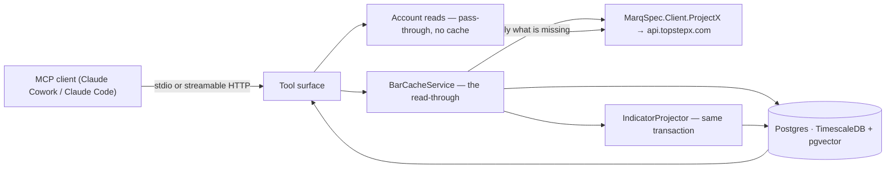

# Architecture

**Companion to:** [`prd.md`](prd.md) (*what* must be true) and [`mcp-tool-catalog.md`](mcp-tool-catalog.md)
(the surface). **Status:** Living · **Date:** 2026-08-21

The runtime view: the pieces, and what happens on a tool call.

## Shape

Three assemblies, layered so the pure part stays pure:

| Project | Depends on | Holds |
|---|---|---|
| `…​.Domain` | **nothing** | `Bar`, `InstrumentId`, `InstrumentSpec`, `IIndicator` + implementations, `BarSessionCalendar`, `BarGapDetector`, `KeyLevels` |
| `…​.Data` | Domain | Entities, `DbContext`, migrations |
| `MarqSpec.Mcp.TopstepX` | Domain, Data, the venue client | Tools, transports, cache-aside services, composition root |

`Domain`'s emptiness is load-bearing. An indicator is a pure function of the bars handed in, and that is what
makes "rebuild = replay" true — a dependency on a clock or a store there would make a recomputation depend on
*when* it ran, and no test would notice.

## The cache-aside read — the only genuinely interesting path

`BarCacheService.GetBarsAsync(instrument, resolution, window)`:

1. **Read** stored bars for the window.
2. **Ask the calendar** which buckets the venue was expected to publish — `BarGapDetector.ExpectedBuckets`
   over `BarSessionCalendar`.
3. **Diff.** Nothing missing ⇒ return. **Zero vendor calls** (R-1.3).
4. **Consult the coverage ledger.** A range the vendor previously answered empty is treated as covered, so a
   genuine hole is not re-requested forever.
5. **Fetch** each remaining range, paged at `1000 × barSize` — the gateway caps a history call at 1000 bars and
   silently truncates past it.
6. **Drop still-forming bars** (`OpenTime + barSize <= now`) even though the request already sends
   `includePartialBar: false`. This does not depend on a venue behaving.
7. **Upsert** on `(Venue, Instrument, ResolutionMinutes, BucketStart)` — load the overlap, merge in memory, one
   save. The composite key *is* the idempotence guard.
8. **Project indicators** for the affected buckets, in the same unit of work, so an indicator exists the moment
   its bar does.
9. **Record coverage** for ranges that came back empty.

### Why step 2 exists

Without it, "the store has no bar at 03:00 on Sunday" and "the store is missing a bar the venue published" are
the same observation. A cache built on that difference-blindness asks the vendor for the weekend on every call,
gets an empty answer, concludes nothing, and asks again. The session calendar is what turns an unbounded loop
into a terminating one. Detail: [ADR-0005](adr/0005-session-aware-gap-detection.md).

### Why step 4 exists, and where it has no prior art

`trading-copilot` polls a fixed watchlist on a timer, so it never faces "an agent asked for an arbitrary cold
range twice in a row". This server does, on every call. A range the venue genuinely has no data for — before
the contract listed, a session the exchange cancelled — is expected by the calendar and absent from the store,
which is indistinguishable from a fetch that has not happened yet. The `BarCoverage` ledger is the third state.

Its TTL is asymmetric: **short near `now`** (a bucket that is empty because it has not printed yet will print
shortly) and **long for settled history** (a hole in 2024 is not going to fill in).

## The indicator projection

Indicators are **projections** over the bar store, not facts. Every row is reproducible from `Bars`, and that
is the point ([ADR-0006](adr/0006-indicators-as-projections.md)).

A projection seeds from the **start of the stored series**, never from a moving window. Wilder smoothing is
path-dependent: seeding from a window would make a value depend on how much history happened to be loaded, so
two runs over identical data would disagree and neither would be wrong in a way you could point at.

`(Venue, Instrument, ResolutionMinutes, Indicator, Period, BucketStart)` is the key. `RecordedAt` is bumped
only when a value actually changes, so a rebuild that confirms the existing numbers leaves the timestamps alone
and the diff is empty.

Multi-output and multi-parameter indicators are the awkward case: the key carries *one* period, and MACD takes
three parameters. The non-period ones are **fixed at their conventional values** rather than hidden behind a
config knob the key cannot see — two parameterisations written under one key are indistinguishable once stored.

## Transports

One host, one tool registration, two ways in ([ADR-0007](adr/0007-dual-transport.md)):

- **stdio** — what an MCP client launches locally. **All logging goes to stderr**; anything on stdout corrupts
  the protocol frame, and it surfaces as a confusing handshake error rather than as a logging problem.
- **streamable HTTP** — for a deployed instance, behind a bearer token.

## What is deliberately absent

- **No order path.** Not a guarded one ([ADR-0002](adr/0002-read-only-venue-boundary.md)).
- **No SignalR recording.** The market hub is not subscribed, so there is no live quote and no order flow. That
  is why there is no `get_quote`: the most recent *closed bar* is the freshest thing this server can honestly
  serve.
- **No background poller.** Every fetch is caused by a tool call. A warm-loop service is a reasonable later
  addition for a deployed instance; it is not needed for a local one and it would call the vendor while nobody
  is asking.
- **No LLM.** This server hands an agent numbers. The reasoning happens in the client.
